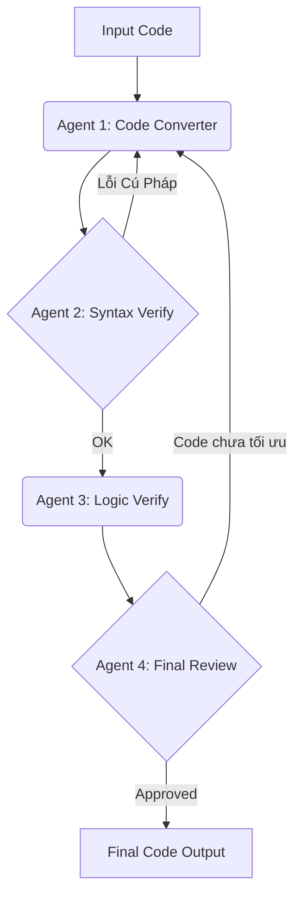

# Kế Hoạch Xây Dựng Hệ Thống Multi-Agent Cho Code Conversion & Review

## 1. Tổng quan
Dự án nhằm mục đích xây dựng một hệ thống pipeline tự động sử dụng AI Agents để chuyển đổi mã nguồn (convert), kiểm tra tính đúng đắn (verify), và review chất lượng code cuối cùng.

**Công nghệ đề xuất:**
- **Ngôn ngữ:** Python 3.10+
- **Framework Orchestration:** CrewAI hoặc LangGraph.
- **LLM Backend:** OpenAI API (GPT-4) hoặc Azure OpenAI (Mạnh về code).

---

## 2. Định nghĩa các Agent

### Agent 1: Code Converter (Người chuyển đổi)
- **Role:** Senior Software Engineer / Polyglot Developer.
- **Nhiệm vụ:** Nhận code đầu vào (ví dụ: C++ từ module `ARD_ARMS`) và chuyển đổi sang code đích (ví dụ: Python hoặc C++ chuẩn mới) hoặc refactor code hiện tại.
- **Yêu cầu:** Giữ nguyên logic gốc, chỉ thay đổi cú pháp và thư viện tương ứng.

### Agent 2: Syntax Verifier (Người kiểm tra cú pháp)
- **Role:** Build Engineer / Compiler Specialist.
- **Nhiệm vụ:** Kiểm tra code vừa được tạo ra có đúng cú pháp không.
- **Tools hỗ trợ:** Python `ast` module, `pylint`, `flake8`, hoặc trình biên dịch C++ (`g++`, `cmake`).
- **Hành động:** Nếu code lỗi cú pháp -> Gửi feedback trả lại cho Agent 1 sửa. Nếu OK -> Chuyển tiếp.

### Agent 3: Logic Verifier (Người kiểm tra logic)
- **Role:** QA Automation Engineer / Algorithm Specialist.
- **Nhiệm vụ:** Đọc code gốc và code mới để đảm bảo tính tương đồng về logic (semantic equivalence). Tìm các lỗi logic tiềm ẩn (infinite loops, memory leaks, sai lệch thuật toán).
- **Hành động:** Viết unit test nhanh (nếu cần) hoặc phân tích luồng dữ liệu (Data Flow Analysis).

### Agent 4: Chief Reviewer (Người đánh giá tổng thể)
- **Role:** Tech Lead / Software Architect.
- **Nhiệm vụ:** Đọc báo cáo từ Syntax Verifier và Logic Verifier. Đánh giá chất lượng code (naming convention, docstrings, modularity, performance).
- **Output:** Code hoàn chỉnh cuối cùng kèm theo báo cáo review chi tiết.

---

## 3. Kiến trúc luồng hệ thống (Workflow/Process)

Sử dụng quy trình tuần tự có phản hồi (Sequential with Feedback Loop):



---

## 4. Các bước triển khai (Implementation Steps)

### Giai đoạn 1: Thiết lập môi trường
1. Tạo môi trường Python ảo (`venv`).
2. Cài đặt thư viện: `pip install crewai langchain_openai`.
3. Cấu hình API Key.

### Giai đoạn 2: Code Define Agents
- Tạo file `agents.py` để định nghĩa 4 role, goal, backstory cho từng agent.
- Tích hợp các công cụ (Tools) cho Agent 2 (ví dụ: tool chạy lệnh terminal để check syntax).

### Giai đoạn 3: Define Tasks & Crew
- Tạo file `tasks.py` để mô tả cụ thể input/output của từng bước.
- Tạo file `main.py` để khởi tạo `Crew` và chạy quy trình.

### Giai đoạn 4: Thử nghiệm (Pilot)
- Chọn một file mẫu nhỏ trong thư mục `ARD_ARMS` hoặc `Vision` để chạy thử nghiệm.

---

## 5. Ví dụ cấu trúc thư mục dự án

```
MultiAgent_Builder/
├── agents.py           # Định nghĩa 4 agents
├── tasks.py            # Định nghĩa nhiệm vụ cụ thể
├── tools.py            # Các tool check syntax/logic custom
├── main.py             # Entry point
├── .env                # API Keys
└── output/             # Thư mục chứa code kết quả
```

## 6. Action Items tiếp theo
- [ ] Xác nhận framework sẽ sử dụng (CrewAI được khuyến nghị vì dễ setup role).
- [ ] Bắt đầu setup môi trường và viết code cho `agents.py`.
