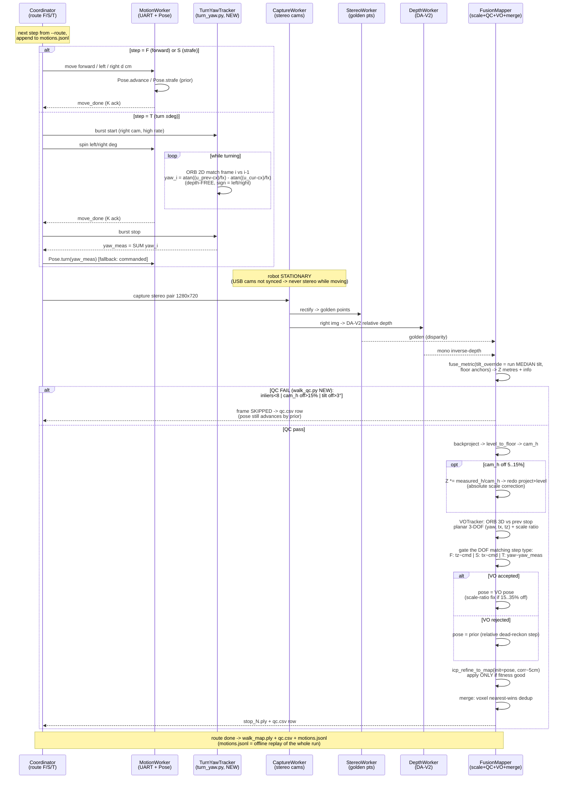
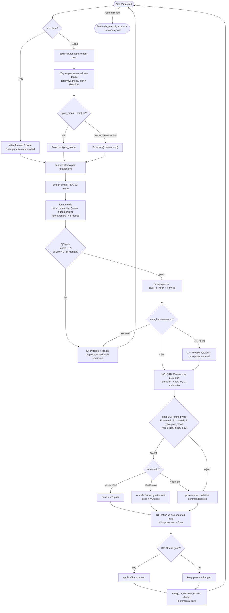
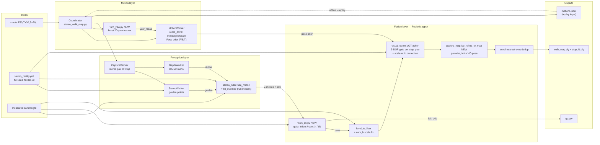

# Deepmap — Free-Movement Multi-Frame Merge (Design)

Fixes the wrong merge (ghosts / rotated pieces / scale mismatch / mess) when the
robot moves freely (forward `F`, strafe `S`, turn `T`) between captures.

Three pillars:
1. **One scale for all frames** — stereo ruler stays, but tilt = run-median,
   `cam_h` corrects absolute scale, VO scale-ratio chains frames to frame 0.
2. **Measured pose, not commanded pose** — burst-capture 2D yaw during turns
   (depth-free), VO 3-DOF (yaw, tx, tz) between stops, gated per motion type.
3. **No bad frame enters the map** — QC gate before merge; ICP only refines
   already-good poses.

---

## 1. Sequence diagram — one route step

---

## 2. Activity diagram — per-frame decision logic

---

## 3. Logic / component diagram — modules and data flow

---

## Pose decision — 3 layers (why the map stops ghosting)

| Layer | Source | Corrects | When it loses |
|---|---|---|---|
| 1. Prior | commanded steps (dead-reckon F/S/T) | nothing — just a starting guess | always kept as fallback |
| 2. Burst yaw | 2D matches during turn (depth-free) | turn angle + direction | too few features while spinning |
| 3. VO 3-DOF | 3D matches between stops | slip on all of tx/tz/yaw + scale drift | low overlap / textureless scene |
| 4. ICP | cloud-vs-map geometry | last few cm of residual | never trusted unless fitness is good |

Each layer only refines the previous one; a failed layer falls back, never
poisons. Bad frames are removed by the QC gate *before* pose even matters.

## New / modified files

| File | Change |
|---|---|
| `deepmap/walk_qc.py` | NEW — QC record + gate + qc.csv |
| `deepmap/turn_yaw.py` | NEW — burst 2D yaw tracker for turns |
| `deepmap/stereo_walk_map.py` | route F/S/T, motions.jsonl, replay-from-log, QC + cam_h fix + ICP wiring |
| `deepmap/visual_odom.py` | motion-type-aware gates, scale-ratio correction output |
| `deepmap/explore_map.py` | `Pose.strafe`, `icp_refine_to_map`, nearest-wins voxel dedup |
| `depth-anything/src/stereo_ruler.py` | `tilt_override` param in `fuse_metric` |
