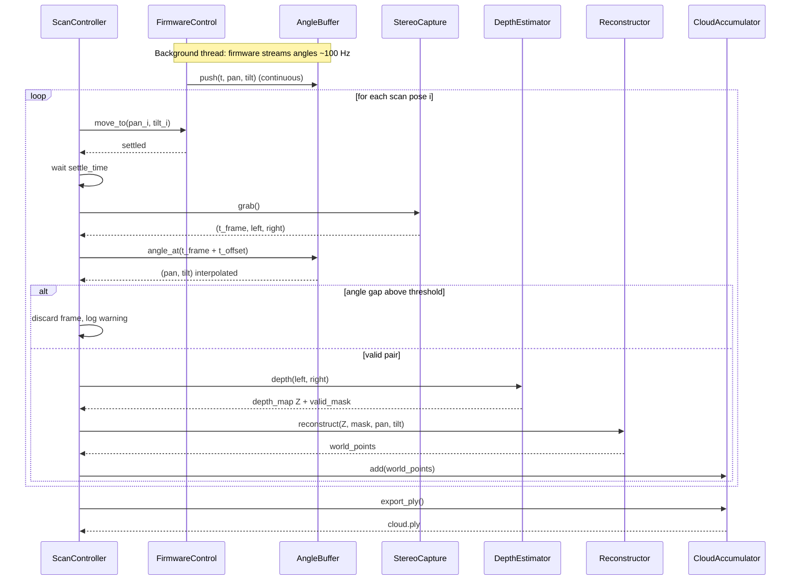
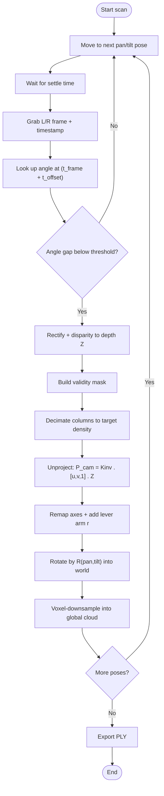

# Stereo Pan-Tilt Point Cloud — Implementation Plan

A step-by-step build plan you can drive with Claude Code. It centers on your core
problem: you already have **(A) stereo frame reading (2 cameras)** and
**(B) firmware control (pan/tilt)**, and you need to **fuse them into one point cloud**.

The plan is ordered so geometry correctness comes first, then sync, then quality.
Each phase is independently testable, so Claude Code can implement and verify one
phase before moving on.

---

## 0. The integration problem in one sentence

Each stereo frame is captured at a time `t_frame`; the firmware reports pan/tilt
continuously. To place a frame's points correctly in the world, every frame must be
paired with the pan/tilt **at its exact capture time**, then each pixel is unprojected
through the camera intrinsics, offset by the lever arm, and rotated into the world frame.

The whole module is a contract between three clocks and one coordinate convention.
Get those two things right and everything else is mechanical.

---

## 1. Architecture

```
                 ┌──────────────────────────┐
   firmware ───▶ │ AngleReader (≈100 Hz)    │──push(t,pan,tilt)─▶ AngleBuffer (ring)
   (part B)      └──────────────────────────┘                          │
                                                                        │ angle_at(t)
   2 cameras ──▶ ┌──────────────────────────┐                          ▼
   (part A)      │ StereoCapture            │──(t,L,R)─▶ ScanController ──▶ DepthEstimator
                 └──────────────────────────┘                 │                │
                                                               │           depth Z + mask
                                                               ▼                ▼
                                                         Reconstructor ◀────────┘
                                                               │ world points
                                                               ▼
                                                       CloudAccumulator (voxel grid) ──▶ cloud.ply
```

Threading model (recommended **stop-and-shoot** first, see §6):
- One background thread runs `AngleReader`, pushing timestamped angles into a lock-free / mutex ring buffer.
- The main thread runs `ScanController`: move → settle → capture → pair → reconstruct → accumulate.
- Depth estimation can later be moved to a worker thread or GPU; keep it synchronous until the pipeline is correct.

---

## 2. Module / file layout

Default language is **Python (NumPy + OpenCV + Open3D)** for the fusion core; your
existing parts A and B can stay in whatever language they are and be wrapped behind
the two adapter interfaces (`StereoCapture`, `FirmwareControl`).

```
stereo_cloud/
  config.py          # K, baseline, lever arm r, t_offset, conventions, thresholds
  timebase.py        # single monotonic clock + timestamp helper
  angle_buffer.py    # ring buffer + interpolation + angle_at(t)
  firmware_control.py# adapter around your part B (move_to, read_angle)
  stereo_capture.py  # adapter around your part A (grab -> t, L, R)
  depth.py           # rectify + disparity -> depth Z + validity mask
  geometry.py        # unproject, axis remap, lever arm, rotation R(pan,tilt)
  reconstruct.py     # depth+angle -> world points (uses geometry.py)
  accumulate.py      # voxel-grid accumulation + PLY export
  sync.py            # pairing + t_offset estimation utilities
  scan_controller.py # the orchestration loop
  main.py            # entry point
  calibration/
    lever_arm.py     # estimate r
    hand_eye.py      # optical-axis vs mechanical-zero offset
    t_offset.py      # temporal offset estimation
  tests/
    test_geometry.py
    test_angle_buffer.py
    test_sync.py
    test_depth.py
    test_reconstruct.py
    test_accumulate.py
    test_end_to_end.py
    fixtures/          # synthetic scenes + recorded sample data
```

---

## 3. Coordinate & math conventions (the contract — write this once, never deviate)

- **World/body axes:** X forward, Y right, Z up. (Note: this triple is *left-handed*.
  Pick ONE: either negate one axis to make it right-handed so stock rotation libraries
  behave, or build `R` by hand to match. Decide here and document it.)
- **Depth `Z`:** distance along the optical axis (what stereo gives), NOT euclidean range.
- **Per-pixel unprojection:** `P_cam = K⁻¹ · [u, v, 1]ᵀ · Z`.
- **Axis remap:** map OpenCV camera frame (x right, y down, z forward) into body frame
  (X = +z_cam, Y = +x_cam, Z = −y_cam) — verify the signs against the validation tests below.
- **Lever arm `r`:** camera optical-center position relative to the pan/tilt axis intersection, in body frame.
- **Rotation order:** fixed and documented, e.g. `R = R_pan(θ) · R_tilt(φ)`.
- **Full transform:** `P_world = R(θ, φ) · (r + P_body)`.
- **Do NOT** apply `X = d·cosφ·cosθ …` — that spherical form is only for a single-spot
  rangefinder and double-counts the angle when used on a depth map.

Three validation points that must hold (used by `test_geometry.py`):

| Pixel (centre) | pan θ | tilt φ | Expected world (X,Y,Z) |
|---|---|---|---|
| (cx, cy), Z=1000 | 0° | 0° | (1000, 0, 0) — forward |
| (cx, cy), Z=1000 | 90° | 0° | (0, 1000, 0) — right |
| (cx, cy), Z=1000 | 0° | 90° | (0, 0, 1000) — up |

---

## 4. Sequence diagram — runtime fusion of the two parts



---

## 5. Activity diagram — per-pose processing logic



---

## 6. The sync design (this is the heart of fusing parts A and B)

Two capture modes. **Implement stop-and-shoot first** — it removes motion blur,
rolling-shutter shear, and left/right desync as concerns, so you can validate geometry
without fighting timing.

**Stop-and-shoot (Phase 6):**
1. Command pan/tilt to pose `i`, wait for "settled" + a fixed settle delay.
2. Camera is stationary → grab one stereo pair, timestamp it.
3. Angle is constant → `angle_at(t_frame)` is exact; threshold rejection is mostly a sanity check.
4. Move to next pose.

**Continuous sweep (Phase 8, optional):**
1. Firmware sweeps at constant angular velocity; cameras free-run.
2. Each frame's timestamp is paired with an **interpolated** angle (linear, or SLERP on quaternions), not nearest.
3. Apply calibrated `t_offset` (the fixed latency between the camera clock and the angle clock).
4. Respect the blur limit: `angular_velocity × exposure_time < one pixel's angular size`.
5. Requires global-shutter, hardware-synced (genlocked) stereo. If you can't confirm that, stay on stop-and-shoot.

**Clock rule:** stamp frames and angles from the SAME monotonic clock if at all possible.
If they come from different clocks, you must estimate both a fixed offset and watch for drift.

---

## 7. Step-by-step build phases

Each phase lists a goal, the files touched, a ready-to-paste Claude Code prompt, the
"done when" criterion, and which tests gate it.

### Phase 0 — Skeleton & config
- **Goal:** project layout, `config.py` with all constants, the convention doc from §3.
- **Claude Code prompt:** *"Create the package layout in §2 with empty stubs and a fully
  populated `config.py` holding fx, fy, cx, cy, baseline, lever_arm r (3-vector),
  t_offset, angle_gap_threshold_ms, z_min, z_max, voxel_size, column_decimation,
  rotation_order, handedness. Add a module docstring restating the coordinate contract."*
- **Done when:** package imports cleanly; config values are documented.

### Phase 1 — Geometry core (do this before anything else)
- **Goal:** pure functions `unproject`, `remap_axes`, `rotation(pan, tilt)`, `to_world`.
- **Prompt:** *"Implement `geometry.py`: unproject(u,v,Z,K) vectorized over arrays;
  remap_axes; rotation(pan,tilt) honoring config.rotation_order and handedness;
  to_world(P_cam, pan, tilt, r). No loops over pixels — use NumPy. Then write
  `tests/test_geometry.py` covering the three validation points in §3, an off-centre
  pixel, and a synthetic flat-wall planarity check."*
- **Done when:** `test_geometry.py` passes, including flat-wall RMS < 1 mm on noise-free input.

### Phase 2 — Angle buffer & interpolation
- **Goal:** ring buffer with O(1) insert and `angle_at(t)` via interpolation.
- **Prompt:** *"Implement `angle_buffer.py` as a fixed-size ring buffer of
  (timestamp, pan, tilt). Provide angle_at(t) doing linear interpolation between the two
  bracketing samples, returning also the time gap to the nearest sample. Write
  `tests/test_angle_buffer.py`."*
- **Done when:** interpolation tests pass (see §8).

### Phase 3 — Depth estimation
- **Goal:** rectify + disparity → depth `Z` + validity mask.
- **Prompt:** *"Implement `depth.py`: stereo rectification from calibration, SGBM
  disparity, disparity→depth using baseline and fx, and a validity mask dropping
  NaN/inf/zero disparity and depths outside [z_min, z_max]. Write `tests/test_depth.py`
  using a synthetic constant-disparity image."*
- **Done when:** known disparity maps to known depth; mask counts are correct.
- **Field note (2026-06-21, from `tools/depth_grid.py`):** uncalibrated rectification
  (`stereoRectifyUncalibrated` from SIFT matches + fundamental matrix) *does* fix row
  alignment — on a real saved pair it cut the inlier vertical residual from ~60 px to
  ~0.3 px — but only when `findFundamentalMat` uses a TIGHT RANSAC threshold (1.0 px,
  conf 0.999); a loose threshold (3.0) produced a degenerate homography (residual
  ~1900 px). Even when correct, the warp adds black borders + perspective skew that
  *lower* SGBM coverage (~44% → ~20% valid cells here). Lesson: uncalibrated rectify
  trades coverage for geometric correctness and still fixes neither lens distortion nor
  absolute scale. For the production module, use a REAL stereo calibration (Q matrix +
  `initUndistortRectifyMap` + `reprojectImageTo3D`), not the uncalibrated shortcut.

### Phase 4 — Adapters for your existing parts A and B
- **Goal:** wrap part A behind `StereoCapture.grab() -> (t, L, R)` and part B behind
  `FirmwareControl.move_to(pan,tilt)`, `.read_angle() -> (t, pan, tilt)`.
- **Prompt:** *"Create `stereo_capture.py` and `firmware_control.py` as thin adapters
  with the interfaces above. Include a `MockStereoCapture` and `MockFirmware` that
  replay fixture data so the pipeline runs without hardware."*
- **Done when:** mocks drive the pipeline end to end offline.

### Phase 5 — Reconstruction on one frame
- **Goal:** `reconstruct(Z, mask, pan, tilt)` → world points, with decimation.
- **Prompt:** *"Implement `reconstruct.py` combining depth.py + geometry.py: apply mask,
  decimate columns to config.column_decimation, unproject, to_world. Write
  `tests/test_reconstruct.py` that feeds a synthetic depth map of a known plane and
  asserts the reconstructed plane matches ground truth within tolerance."*
- **Done when:** single-frame cloud matches synthetic ground truth.

### Phase 6 — Scan controller (stop-and-shoot) + accumulation
- **Goal:** full multi-pose loop producing one cloud.
- **Prompt:** *"Implement `accumulate.py` (Open3D voxel grid + PLY export) and
  `scan_controller.py` running the stop-and-shoot loop from §6 with the 3-frame pan
  tiling (centres −44°, 0°, +44°). Wire `main.py`. Write `tests/test_end_to_end.py` using
  the mocks to scan a synthetic room and assert the merged cloud is planar where it should be."*
- **Done when:** end-to-end test produces a correct merged cloud; walls stay planar across poses.

### Phase 7 — Quality pass
- **Goal:** validity tuning, voxel dedup verification, edge-column trimming, point budget.
- **Prompt:** *"Add edge-column trimming (drop outer 5–10% per frame), confirm voxel
  dedup collapses overlap duplicates, and add a cloud-size guard. Extend tests for
  overlap dedup and edge trimming."*
- **Done when:** overlapping regions don't double; cloud size bounded.

### Phase 8 — Calibration & continuous mode (optional, do last)
- **Goal:** estimate `r`, hand-eye offset, and `t_offset`; add continuous sweep.
- **Prompt:** *"Implement calibration/lever_arm.py (flat-wall bow minimization),
  hand_eye.py (checkerboard at known angles), t_offset.py (sharpen a moving edge).
  Add a continuous-sweep mode to scan_controller using interpolated angles + t_offset.
  Gate continuous mode behind a global-shutter/genlock config flag."*
- **Done when:** calibration routines converge on fixtures; continuous mode matches
  stop-and-shoot within tolerance.

---

## 8. Test cases

Concrete, with expected values where possible. Use `fx=fy=600, cx=320, cy=240` unless noted.

### Geometry (`test_geometry.py`)
| ID | Input | Expected | Checks |
|---|---|---|---|
| G1 | centre pixel, Z=1000, θ=0, φ=0, r=0 | (1000, 0, 0) | forward axis |
| G2 | centre pixel, Z=1000, θ=90, φ=0 | (0, 1000, 0) | right axis / rotation |
| G3 | centre pixel, Z=1000, θ=0, φ=90 | (0, 0, 1000) | up axis / tilt |
| G4 | pixel (440,240), Z=1000, θ=0, φ=0 | (1000, 200, 0) | per-pixel ray, not single direction |
| G5 | synthetic plane X=2000, all pixels, noise-free | planarity RMS < 1 mm | unproject+transform sanity |
| G6 | same plane across θ ∈ {−44,0,44} | merged planarity RMS < 2 mm | rotation/lever consistency |

### Angle buffer (`test_angle_buffer.py`)
| ID | Setup | Query | Expected |
|---|---|---|---|
| A1 | samples (0ms,0°),(10ms,10°) | angle_at(5ms) | 5° (interpolated), gap ≈ 5 ms |
| A2 | same | angle_at(0ms) | exactly 0° |
| A3 | gap of 50 ms around query | angle_at(mid) | flagged: gap > threshold |
| A4 | wrap-around past buffer capacity | oldest evicted | newest retrievable, no crash |

### Sync / t_offset (`test_sync.py`)
| ID | Setup | Expected |
|---|---|---|
| S1 | nearest vs interp on moving angle | interp error < nearest error |
| S2 | angles shifted by known 8 ms, run sharpness metric | recovered t_offset ≈ 8 ms (±1 ms) |
| S3 | frame with no angle within threshold | frame discarded, counted |

### Depth (`test_depth.py`)
| ID | Setup | Expected |
|---|---|---|
| D1 | constant disparity d, baseline B, fx | Z = fx·B/d everywhere |
| D2 | inject NaN/0/inf pixels | masked out; mask count exact |
| D3 | depths outside [z_min,z_max] | clamped/dropped per policy |

### Reconstruction & accumulation
| ID | Setup | Expected |
|---|---|---|
| R1 | synthetic plane, decimation=9 | ≈ width/9 columns kept |
| R2 | known plane | reconstructed normal & offset within tolerance |
| C1 | two overlapping frames of same wall, voxel=5 mm | point count ≈ single frame (no doubling) |
| C2 | export then reload PLY | round-trips identically |

### End to end (`test_end_to_end.py`)
| ID | Setup | Expected |
|---|---|---|
| E1 | mock scan of synthetic room, stop-and-shoot, 3 pan poses | merged cloud covers −80..+80; walls planar; no gaps in overlap |
| E2 | recorded real sample (1 pose) | runs without error; visual check PLY |

---

## 9. Calibration procedures (Phase 8 detail)

- **Lever arm `r`:** scan a known flat wall across several pan angles; adjust `r` to
  minimize the wall's bow/ghosting (planarity RMS). Converged `r` is the optical centre
  offset from the axis intersection.
- **Hand-eye (optical axis vs mechanical zero):** image a checkerboard held fixed while
  the head moves to several known angles; solve for the constant rotation/offset between
  the camera frame and the firmware's zero.
- **Temporal `t_offset`:** sweep fast across a sharp vertical edge; choose the offset that
  makes that edge sharpest (lowest spread) in the reconstructed cloud.

---

## 10. Config reference (`config.py` keys)

```
fx, fy, cx, cy          # intrinsics (px)
baseline                # stereo baseline (mm)
lever_arm               # r = (rx, ry, rz) in body frame (mm)
t_offset                # camera-clock minus angle-clock (ms)
angle_gap_threshold_ms  # reject frames whose nearest angle is farther than this
z_min, z_max            # valid depth range (mm); z_max where stereo noise ~Z² gets too big
column_decimation       # keep every Nth column (≈ width/72 for ~1 pt/deg)
edge_trim_frac          # drop this fraction of outer columns per frame
voxel_size              # global voxel grid spacing (mm) = target point spacing
rotation_order          # e.g. "pan_then_tilt"
handedness              # "right" (after axis fix) or "left"
shutter_synced          # gate for continuous mode (global shutter + genlock)
```

---

### Suggested first message to Claude Code
> "Read `stereo_pointcloud_plan.md`. Implement Phase 0 and Phase 1 only. Write the tests
> for Phase 1 and run them. Stop and show me results before Phase 2."

Build phase by phase, run the gating tests, and don't advance until they're green — the
geometry phases are where a wrong sign hides, so lock them down before sync and hardware.